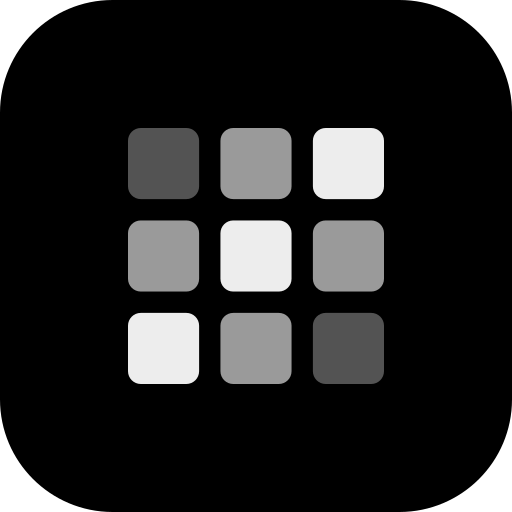

<div align="center">
  
  <h1>evepad</h1>

<a href="https://www.npmjs.com/package/evepad"></a>
<a href="https://github.com/andrewckor/evepad/blob/main/LICENSE"></a>
<a href="https://vercel.com/docs/eve"></a>

</div>

**The missing IDE to build and ship [eve](https://vercel.com/docs/eve) agents.**

A local dashboard and build harness for eve agents. One place for the whole
loop: create an agent → generate and edit its tools by chat (OpenCode via AI
Gateway) → watch local and production runs → add channels and integrations
with the eve CLI → deploy to Vercel.

## Requirements

- **Node 24+**
- **macOS**

**No API keys.** evepad signs in with your Vercel account and uses each
project's own credentials.

Nothing else to install — evepad drives these for you, falling back to `npx`
when they aren't on your PATH:

- **Vercel CLI** — sign-in, project linking, env pulls
- **eve CLI** — scaffolding, the dev server, channels and tools
- **OpenCode** — the engine behind the Build chat, shipped with the package

Sign in from the app's first-run screen.

## Run

```bash
npx evepad
```

Opens http://localhost:4680. The package ships prebuilt, so it starts in
seconds rather than building on your machine.

- `npm i -g evepad` to keep it installed
- `evepad --port 4681` to run it on a different port
- Install it as a PWA (Chrome: **Install evepad**, Safari: **Add to Dock**)
  for its own window and Dock icon

<!-- npm:skip -->

## Develop

```bash
npm install
npm run dev     # http://localhost:5173
npm run pack    # build the publishable package into dist/
```

Contributions welcome — see [CONTRIBUTING.md](CONTRIBUTING.md).
<!-- /npm:skip -->

## Connect your agents

- Finds local agents already running on your machine.
- Connects a local folder to its production agent, so you see both sides in
  one place.
- Creates new agents and links them to Vercel in one step.

## The surfaces

- **Agents** (`/`) — every agent as a card, with live status.
- **Agent Runs** (`/runs`) — runs, tokens and cost at a glance, then the full
  run table and streaming run detail.
- **Build** (`/build`) — chat with a coding agent scoped to your checkout,
  beside a live graph of tools, schedules, channels and connections. Type `/`
  for commands; bash calls ask for approval in-chat.
- **Chat / CLI** — dockable panels: talk to the running agent, or drop into
  its `eve dev` terminal.

## Notes

- Build runs on [OpenCode](https://opencode.ai), authenticated with your
  project's own Vercel credentials through the AI Gateway.

## Notices

evepad is a community project — not affiliated with, endorsed by, or sponsored
by Vercel. "eve" and "Vercel" are trademarks of Vercel, Inc.

The pixel-grid loader (and the app icon derived from it) follows the Loading
State component from [beautifului.dev](https://www.beautifului.dev/).
